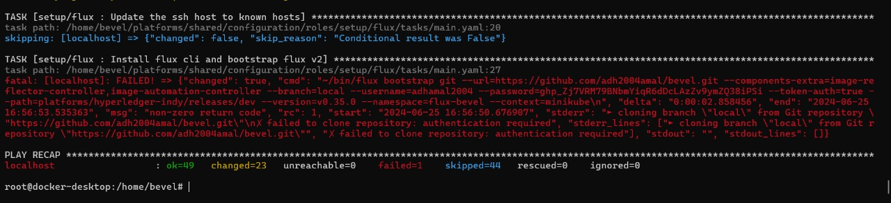
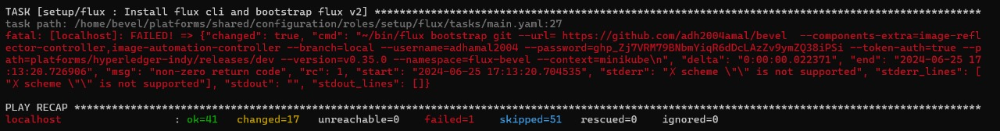
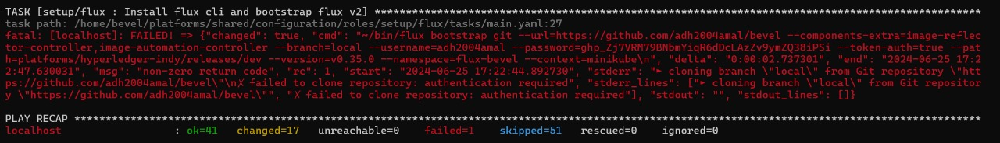
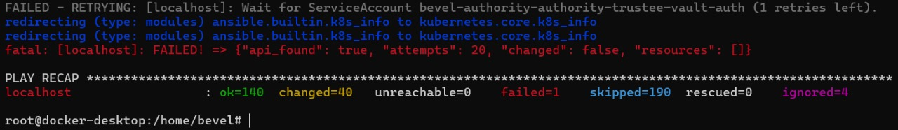

# Hyperledger Exploration  
   <br/>  <br/> 

## Hyperledger Bevel
  <br/>
  

 <p align="center"> </p>

### Introduction
Hyperledger Bevel is an advanced automation framework tailored for the 
seamless deployment of robust, production-ready Distributed Ledger 
Technology (DLT) networks on cloud-based infrastructures. Eliminating the 
need for intricate solution architecture, Bevel empowers teams to deliver with 
precision.

### Which platforms does Bevel Support?
Bevel currently supports the following DLT/Blockchain Platforms:
- R3 Corda
- Hyperledger Fabric
- Hyperledger Indy
- Hyperledger Besu
- Quorum
- Substrate

  
## Pre-requisites
- Git Repository
- HashiCorp Vault
- Minikube
- Docker

### Git Repository
- First, fork the Bevel repository from the [hyperledger/bevel](https://github.com/hyperledger/bevel) main branch.
- Then, create a GitHub personal access token by navigating to **Settings** > **Developer settings** > **Personal access tokens** > **Generate new token**.
- Once it's done, follow the commands to clone repository in host machine.

``` bash
mkdir project
cd project
git clone https://<user_name>:<git_token>@github.com/<user_name>/bevel.git
git remote set-url origin https://<user_name>:<git_token>@github.com/<user_name>/bevel.git #This command changes the remote repository URL to include a GitHub username and token for authentication.
```

-  To create a local branch in your forked repository, follow these commands:

``` bash
cd bevel
git checkout develop # to get latest code
git pull
git checkout -b local
git push --set-upstream origin local
```

- To verify, you can check if the local branch has been created in your forked Bevel repository.

### HashiCorp Vault
- We need Hashicorp Vault for the certificate and key storage.
- To install the binary file, use the following command:

```bash
wget https://releases.hashicorp.com/vault/1.17.1/vault_1.17.1_linux_amd64.zip
unzip vault_1.17.1_linux_amd64.zip
```

- Once the binary `vault` is downloaded, move it `project/bin` folder.

```bash
mkdir project/bin
mv vault ./project/bin/
export PATH=./project/bin:$PATH
```
- Create a `config.hcl` file in `project/` folder with the following contents:

```bash
ui = true
storage "file" {
   path    = "./project/data"
}
listener "tcp" {
   address     = "0.0.0.0:8200"
   tls_disable = 1
}
disable_mlock = true
```

- Start the Vault server by executing the following command. And initialize the Vault by providing your choice of key shares and threshold.  (this will occupy one terminal)

```bash
vault server -config=config.hcl
```

### Minikube

- For development environment, minikube can be used as the Kubernetes cluster on which the DLT network will be deployed.
- To install the binary file, use the following command:

```bash
curl -LO https://storage.googleapis.com/minikube/releases/latest/minikube-linux-arm64
mv minikube-linux-arm64 minikube  # rename the binary to minikube
```

- Move the binary `minikube`, to path `project/bin/` folder.
  
```bash
mv minikube ./project/bin/
```

### Docker
- Docker is a set of platform-as-a-service products that use OS-level virtualization to deliver software in packages called containers.
- Install Docker Desktop from their website [Docker Desktop](https://www.docker.com/products/docker-desktop/)
- Or install it through CLI using the following commands:
```bash
sudo apt-get update
sudo apt-get install apt-transport-https ca-certificates curl software-properties-common
curl -fsSL https://download.docker.com/linux/ubuntu/gpg | sudo apt-key add -
sudo add-apt-repository "deb [arch=amd64] https://download.docker.com/linux/ubuntu $(lsb_release -cs) stable"
sudo apt-get update
sudo apt-get install docker-ce
```

#### Directory Structure (After Pre-requisites)
```bash
project
│   ├── config.hcl
│
├── bin
│   ├── vault
│   └── minikube
│
└── bevel
```


##  Deploying a DLT network on Minikube using Bevel
1. start minikube, use [public ip](https://ipv4.icanhazip.com/) to check for the ip address.
```bash
minikube start --memory 2000 --cpus 2 --kubernetes-version=1.23.1 --apiserver-ips=<specify public ip of VM>
```
2. Start a proxy which is required for ansible controller to access the minikube k8s
```bash
docker run -d --network minikube -p 18443:18443 chevdor/nginx-minikube-proxy
```
3. Create an `build` folder inside `./project/bevel/` folder.
```bash
mkdir ./project/bevel/build
```
4. Copy ca.crt, client.key, client.crt from `~/.minikube` to `./project/bevel/build` folder.
```bash
cp ~/.minikube/ca.crt build/
cp ~/.minikube/profiles/minikube/client.key build/
cp ~/.minikube/profiles/minikube/client.crt build/
```
5. Copy `~/.kube/config` file `./project/bevel/build` folder.
```bash
cp ~/.kube/config build/
```
6. Open the above `config` file in build directory and update file path for `certificate-authority`, `client-certificate` and `client-key` to `home/bevel/build/ca.crt`, `home/bevel/build/client.crt` and `home/bevel/build/client.key` respectively. (use `minikube ip` command to find the ip of minikube)
```bash
# example config file
apiVersion: v1
clusters:
- cluster:
    certificate-authority: /home/bevel/build/ca.crt
    extensions:
    - extension:
        last-update: Fri, 28 Jun 2024 13:09:51 IST
        provider: minikube.sigs.k8s.io
        version: v1.33.1
      name: cluster_info
    server: https://<minikube_ip>:8443
  name: minikube
contexts:
- context:
    cluster: minikube
    extensions:
    - extension:
        last-update: Fri, 28 Jun 2024 13:09:51 IST
        provider: minikube.sigs.k8s.io
        version: v1.33.1
      name: context_info
    namespace: default
    user: minikube
  name: minikube
current-context: minikube
kind: Config
preferences: {}
users:
- name: minikube
  user:
    client-certificate: /home/bevel/build/client.crt
    client-key: /home/bevel/build/client.key
```
**NOTE:**
If you ever delete and recreate minikube, the above steps from 4 to 6 has to be repeated.

7. Setup Hashicorp Vault, this has to be done after you have unsealed vault in another terminal. [HashiCorp Vault](./README.md#hashicorp-vault)
```bash
export VAULT_ADDR='http://<Your Vault local IP address>:8200'
export VAULT_TOKEN="<Your Vault root token>"
# enable Secrets v2
vault secrets enable -version=2 -path=secretsv2 kv
```

8. Edit the network configuration file, Choose the DLT/Blockchain platform you want to run and copy the relevant sample network.yaml to `build` folder; rename it to `network.yaml`.
```bash
# For example, for Fabric
cd project/bevel
cp platforms/hyperledger-fabric/configuration/samples/network-proxy-none.yaml build/network.yaml
```
- Open the above `build/network.yaml` in your favourite editor and Update Docker configurations:
```bash
docker:
    url: "ghcr.io/hyperledger"
    # Comment username and password as it is public repo
    #username: "<your docker username>"
    #password: "<your docker password/token>"
```
- For each organization, update ONLY the following and leave everything else as is:
```bash
cloud_provider: minikube
k8s:
    context: "minikube"
    config_file: "/home/bevel/build/config"
vault:
    url: "http://<Your Vault local IP address>:8200" # Use the local IP address NOT localhost e.g. http://192.168.0.1:8200
    root_token: "<your vault_root_token>"
gitops:
    git_protocol: "https" # Option for git over https or ssh
    git_url: "<https/ssh url of your forked repo>" #e.g. "https://github.com/hyperledger/bevel.git"
    git_repo: "<url of your forked repo without the https://>" #e.g. "github.com/hyperledger/bevel.git"
    username: "<github_username>"
    password: "<github token>"
    email: "<github_email>"
```

9. Make sure that Minikube and Vault server are running. Check by running:
```bash
minikube status
vault status
```

10. Now run the following commands to deploy your chosen DLT on minikube:
```bash
cd bevel
docker run -it -v $(pwd):/home/bevel/ -v <absolute path to project/bin folder>:/root/bin/ --network="host" ghcr.io/hyperledger/bevel-build:latest /bin/bash

# Ensure that git config is setup
git config --global user.name "UserName"
git config --global user.email "UserEmailAddress"

cd bevel
./run.sh
```

#### Directory Structure
```bash
project
│   ├── config.hcl
│
├── bin
│   ├── vault
│   └── minikube
│
└── bevel
    └── build
        ├── config
        ├── client.crt
        ├── client.key
        ├── ca.crt
        └── network.yaml
```
**TIP:**
add the following commands to your `.bashrc` file.
```bash
export PATH=./project/bin:$PATH
export VAULT_ADDR='http://<Your Vault local IP address>:8200'
export VAULT_TOKEN="<Your Vault root token>"
```

## Troubleshooting

### Test Kubectl installation

<p align="center"> </p>

- This error is due to wrong configuration of `config` file in `project/bevel/build/config`. The `server:` IP address and port number might be incorrect, or the paths to `certificate-authority:`, `client-certificate:` and `client-key:` might be incorrect. Follow 6th steps in [Deploying a DLT network on Minikube using Bevel](./README.md#deploying-a-dlt-network-on-minikube-using-bevel) to resolve the problem.

### Install flux cli and bootstrap flux v2

<p align="center"> </p>
<p align="center"> </p>
<p align="center"> </p>
<p align="center"> </p>
<p align="center"> </p>

- This error is due to wrong configuration of `network.yaml` file in `project/bevel/build/config`. In the `gitops:` section of `network.yaml`, there might be incorrect details in `git_url:`, `git_repo:`, `username:`, `password:`, `email:`.

### Wait for ServiceAccount

<p align="center"> </p>

- This error is due to an incorrect cloning of the Bevel repository or an expired Git token. Follow steps in the Pre-requisites [Git Repository](./README.md#git-repository) to resolve the problem.

### Write reviewer token for Organizations

<p align="center"> </p>

- This error occurs if you are unable to connect to Vault from inside the Docker container, likely because the `--network="host"` option is not working in your environment. or the Vault server is down.

## References
 - [Deploying a DLT network on Minikube using Bevel](https://hyperledger-bevel.readthedocs.io/en/latest/tutorials/bevel-minikube-setup/)
 - [Developer Pre-requisites](https://hyperledger-bevel.readthedocs.io/en/latest/tutorials/dev-prereq/)
 - [Tool Versions](https://hyperledger-bevel.readthedocs.io/en/latest/references/tool-versions/)
