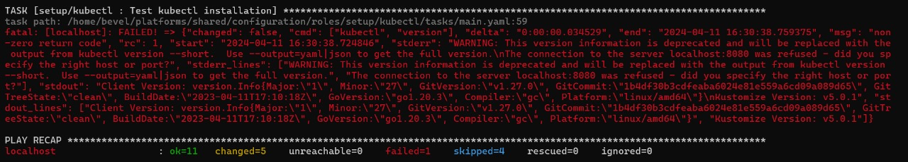
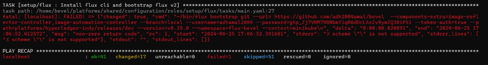
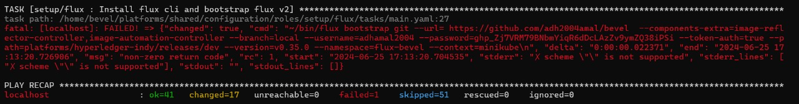
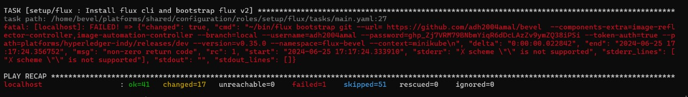
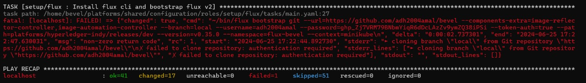
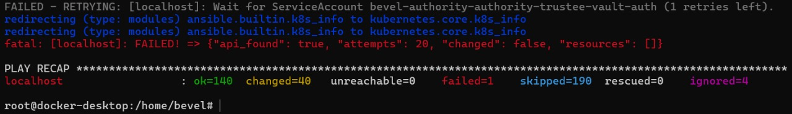
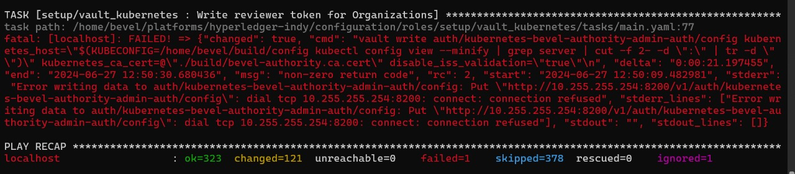

## Troubleshooting

### Test Kubectl installation

 

- This error is due to wrong configuration of `config` file in `project/bevel/build/config`. The `server:` IP address and port number might be incorrect, or the paths to `certificate-authority:`, `client-certificate:` and `client-key:` might be incorrect. Follow 6th steps in [Deploying a DLT network on Minikube using Bevel](https://github.com/AmalRitessh/bevel-instructions/blob/main/README.md#deploying-a-dlt-network-on-minikube-using-bevel) to resolve the problem.

### Install flux cli and bootstrap flux v2

 

 

 

 

 

- This error is due to wrong configuration of `network.yaml` file in `project/bevel/build/config`. In the `gitops:` section of `network.yaml`, there might be incorrect details in `git_url:`, `git_repo:`, `username:`, `password:`, `email:`.

### Wait for ServiceAccount

 

- This error is due to an incorrect cloning of the Bevel repository or an expired Git token. Follow steps in the Pre-requisites [Git Repository](https://github.com/AmalRitessh/bevel-instructions/blob/main/README.md#git-repository) to resolve the problem.

### Write reviewer token for Organizations

 

- This error occurs if you are unable to connect to Vault from inside the Docker container, likely because the `--network="host"` option is not working in your environment. or the Vault server is down.

